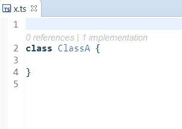
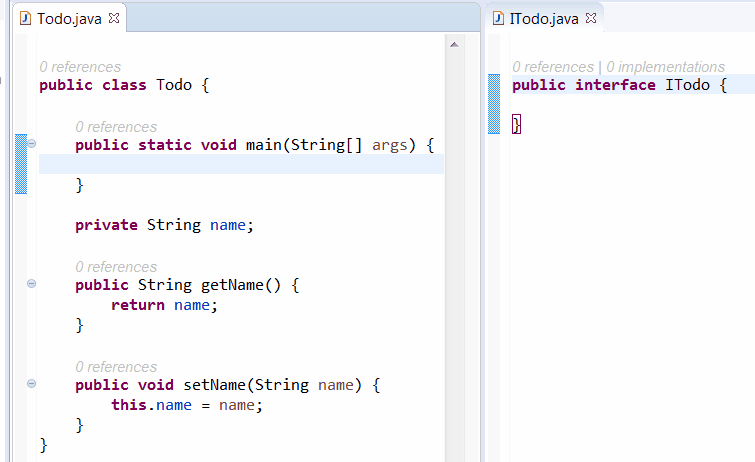
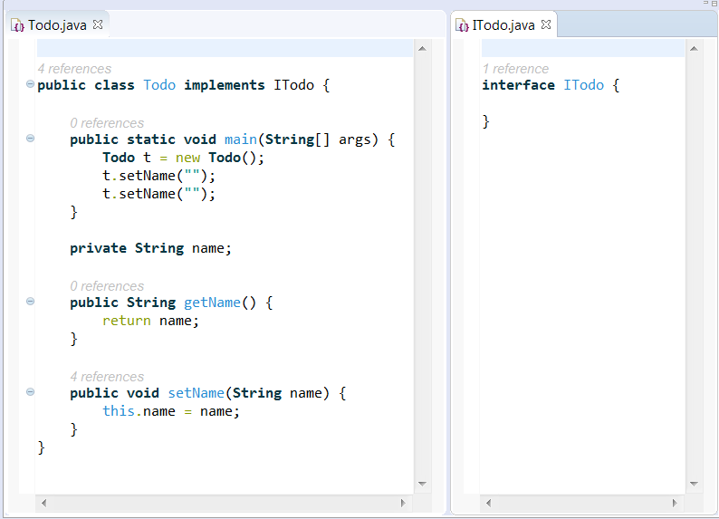
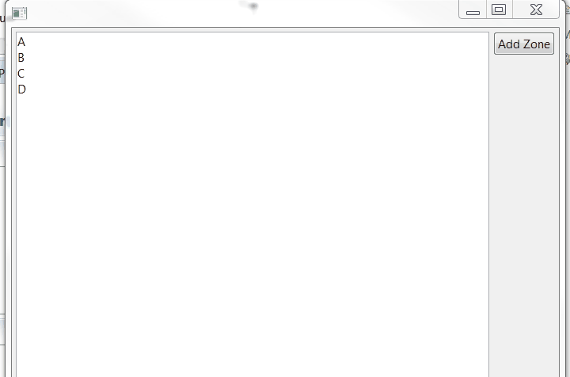

# codelens-eclipse

It exists today 2 bugs for implementing CodeLens inside Eclipse: bug [508458](https://bugs.eclipse.org/bugs/show_bug.cgi?id=508458) and [501546](https://bugs.eclipse.org/bugs/show_bug.cgi?id=501546).

Today Javassist is required because there are 2 problems in Eclipse Platform:

 * bug with line numbers. See bug [481968](https://bugs.eclipse.org/bugs/show_bug.cgi?id=481968)
 * drawing CodeLens update line spacing of the line. Today StyledTExt doesn't provide this feature. See bug [522020](https://bugs.eclipse.org/bugs/show_bug.cgi?id=522020)

This project is a POC to study how to implement CodeLens with Eclipse StyledText

Here a demo with 

 * `TypeScript` with [typescript.java](https://github.com/angelozerr/typescript.java) :

 * `Java` with `JDT Java Editor` :

 * `Java` with [lsp4e Java Editor](https://github.com/eclipselabs/language-servers-for-eclipse/tree/master/org.eclipse.lsp4e.java) which uses Java Language Server of JDT :

 
Here a demo with the current work with StyledText where zone are added:

